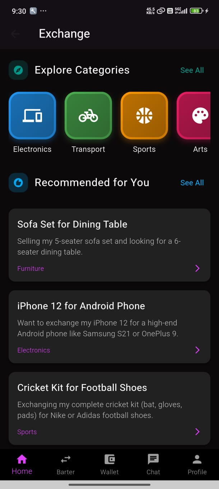
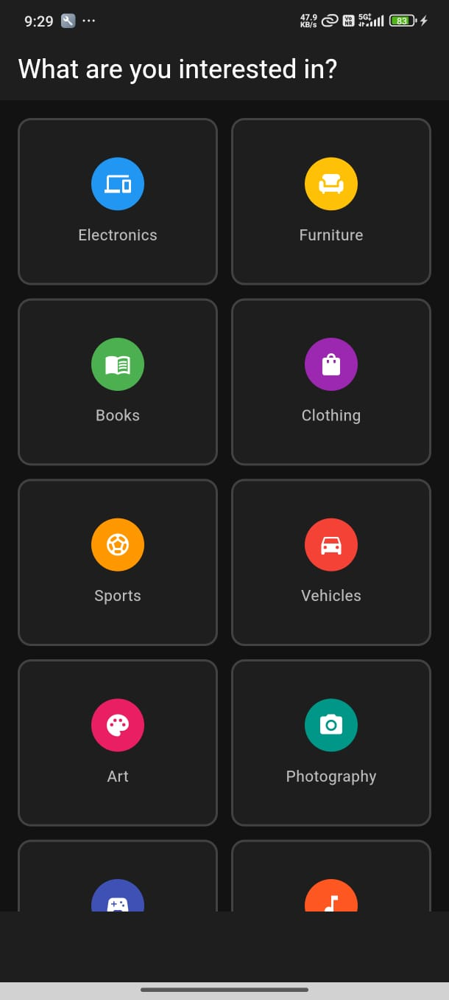
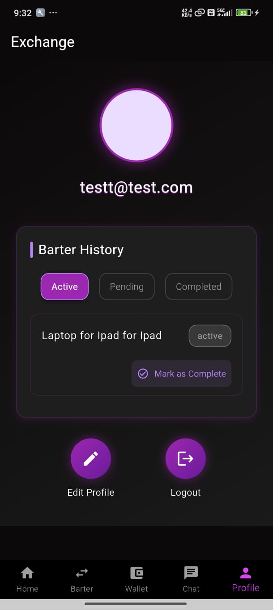
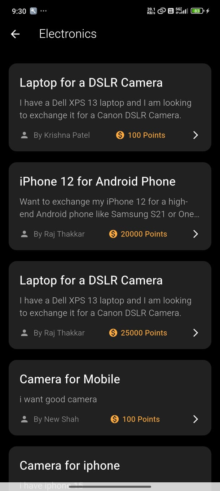
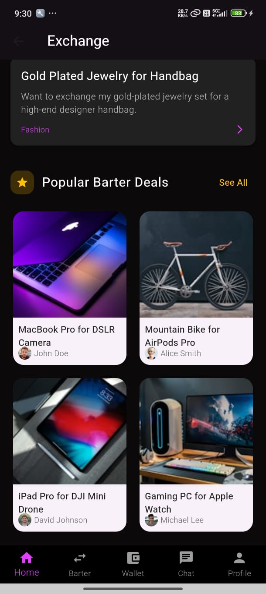
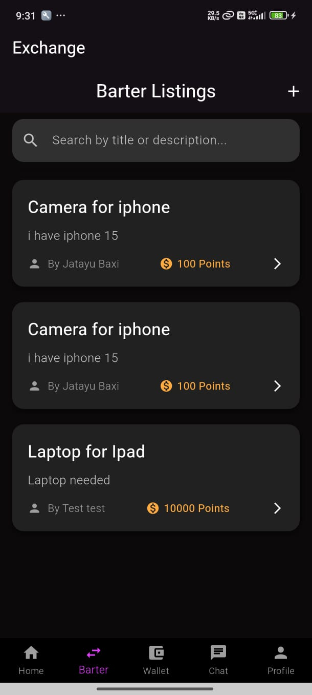
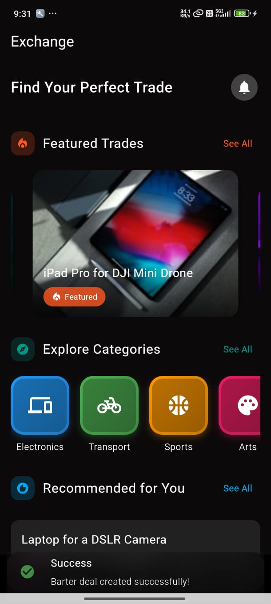
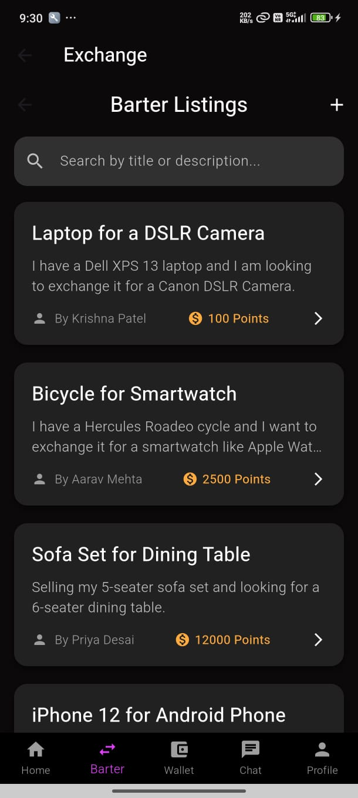

# XChange - The Digital Barter Platform

<a href="https://youtu.be/hYW54EgbSPE" target="_blank">View Application Demo Video</a>


## 📌 Overview
XChange is a revolutionary mobile application designed to bring back the concept of **barter pay**, where users can exchange goods and services directly. This platform ensures value and equality for users while integrating a **barter points system**, which can later be converted into Indian Rupees upon request.


## ✨ Features
- **User Registration & Preferences**: Users create an account, set their preferences, and provide an address.
- **Active Barter Listings**: View all available barter listings in real time.
- **Add Barter Items**: Users can list their own items for barter.
- **Recommendation Model**: AI-powered recommendations based on user preferences and existing barter listings.
- **Barter Points System**: Track earned barter points, which can be later converted to currency.
- **Transaction History**: Monitor barter transactions categorized into **pending, active, and completed**.
## 📷 XChange Image Gallery  

|  |  |  |  |
|---|---|---|---|


|  | |  |  |
|---|---|---|---|


## 🚀 How It Works
1. **Sign Up & Set Preferences**: Users create an account and select their interests.
2. **Browse & List Items**: Users can explore active barters or add their own listings.
3. **Match & Trade**: The app suggests relevant barter opportunities based on preferences.
4. **Earn & Use Barter Points**: Transactions earn barter points, which can be tracked and converted if needed.
5. **Monitor Transactions**: Users can track ongoing, pending, and completed barter deals.


## 🏆 Why Use XChange?
- Encourages **fair and equal trade** among users.
- Revives the **ancient barter system** in a modern, digital form.
- Provides a **secure and transparent** transaction history.
- Offers a **rewarding experience** through barter points.
- Includes an **AI-driven recommendation engine** to suggest the best trades.


## 🔧 Tech Stack
- **Frontend**: Flutter, Dart
- **Backend**: Node.js, Express (for CRUD operations)
- **Database**: MongoDB
- **Recommendation System**: Flask with TF-IDF Cosine Similarity


## 📲 Installation
1. Clone the repository:
   ```sh
   git clone https://github.com/NaitikPatel-325/Xchange.git
   ```
2. Navigate to the project folder:
   ```sh
   cd XChange
   ```
3. Install dependencies:
   ```sh
   npm install
   ```
4. Run the app:
   ```sh
   npm run dev
   ```
5. Also, set up the Flask server:
   ```sh
   python app.py
   ```

## 🛠 Future Enhancements
- Live chat feature for barter negotiations.
- Integration with digital payment platforms.
- Community forums for barter discussions.


## 📜 License
This project is licensed under the MIT License.

